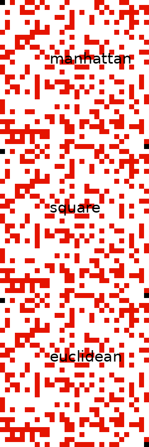
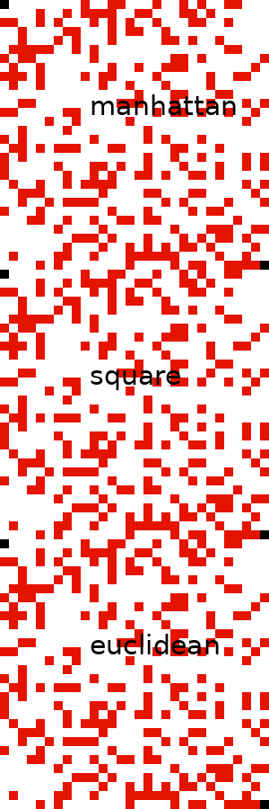

A simple Maze simulator/Solver using the A* algorithm.

Available heuristics are:
 - Manhattan
 - Square
 - Euclidean

With some extra code to visualize the process using the PIL library to auto-generate the paths taken as gifs.

